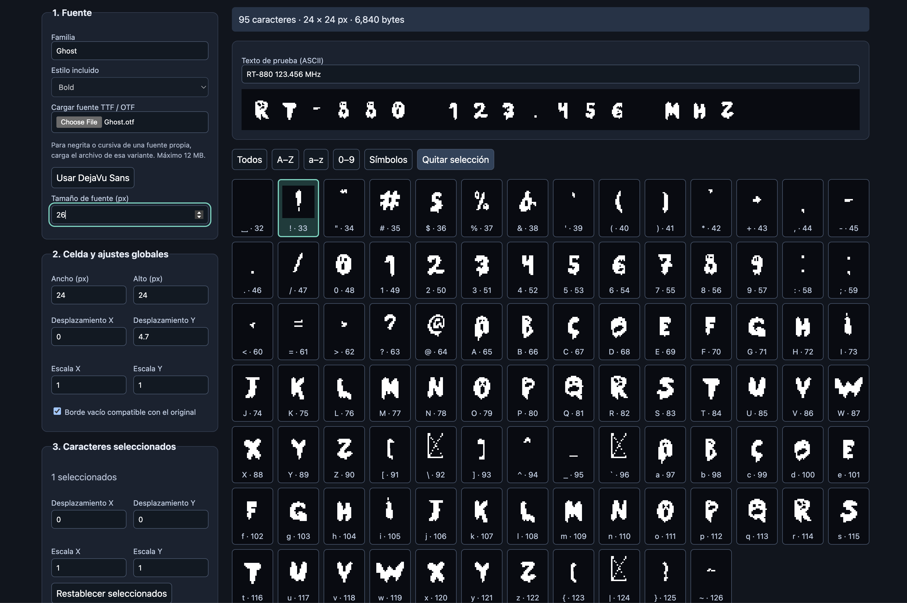

# FontConvert880P

**Convierte fuentes TTF/OTF en fuentes de mapa de bits monocromáticas para RT-880 RMS desde el navegador.**

[English](README.md) · [Español](README_es.md)

FontConvert880P es una implementación independiente en Python del flujo de FontConvert880. Ofrece una interfaz web en español para previsualizar, ajustar, guardar y exportar los 95 caracteres ASCII imprimibles. Docker Compose reúne el servidor y las fuentes incluidas en un contenedor, por lo que el equipo anfitrión no necesita instalar Python ni fuentes.

## Ejemplo de conversión



La captura muestra una fuente **Ghost.otf** proporcionada por el usuario, con tamaño de **26 px**, convertida en celdas de **24 × 24 px**. El desplazamiento vertical global es **4.7** y ambas escalas globales son **1**. La **A** mayúscula, identificada como `A · 65`, es un ejemplo de letra convertida: sus píxeles blancos se convierten en bits activados en el mapa exportado. Cada tarjeta muestra el carácter y su código ASCII decimal; la tarjeta resaltada `! · 33` está seleccionada para ajustes individuales.

El texto de prueba muestra `RT-880 123.456 MHz` utilizando los caracteres convertidos. Cada carácter ocupa **72 bytes**, para un total de **6.840 bytes** con los 95 caracteres. Los píxeles grandes de la pantalla son una ampliación de la vista previa, no una mayor resolución del archivo. Ghost.otf se muestra como ejemplo y **no está incluida** en este repositorio.

## Funcionalidades

- DejaVu Sans incluida: normal, negrita, cursiva y negrita cursiva.
- Carga de archivos propios `.ttf` u `.otf`.
- Tamaño de fuente ajustable y ancho y alto de celda independientes.
- Desplazamiento y escala horizontal/vertical globales y por carácter.
- Selección individual y grupos acumulativos de mayúsculas, minúsculas, números y símbolos.
- Cuadrícula monocromática y texto de prueba editable.
- Guardado y apertura de ajustes `.font880`; exportación binaria `.rmsfont` o código `.c`.
- Un contenedor local, sin cuentas, base de datos ni servicios externos de conversión.

## Inicio rápido con Docker Compose

Instala Docker con el complemento Compose, por ejemplo Docker Desktop, e inicia su motor. Copia o clona este proyecto, abre una terminal en su directorio y ejecuta:

```sh
docker compose up --build -d
```

Abre **http://localhost:8800**. La primera construcción necesita Internet para descargar la imagen base, las dependencias Python y las fuentes DejaVu. Una vez construida, la aplicación convierte sin conexión.

```sh
# Consultar el estado del servicio y su salud
docker compose ps

# Consultar los registros recientes
docker compose logs --tail=100

# Detener y eliminar el contenedor
docker compose down

# Reconstruir después de actualizar los archivos del proyecto
docker compose up --build -d
```

### Puerto y acceso por red

La dirección predeterminada es `127.0.0.1:8800`; dentro del contenedor el servidor escucha en el puerto `8000`. Para cambiar el puerto del anfitrión de forma persistente, crea `.env` junto a `compose.yaml`:

```dotenv
PORT=8880
BIND_ADDRESS=127.0.0.1
```

Ejecuta de nuevo `docker compose up -d` y abre **http://localhost:8880**. Git ignora el archivo `.env`.

Para permitir acceso deliberadamente desde una red local de confianza, configura `BIND_ADDRESS=0.0.0.0` y entra mediante `http://IP_DEL_EQUIPO:PUERTO`. La aplicación no incluye autenticación ni configuración HTTPS; este despliegue no está preparado para exponerse directamente a Internet.

### Mover a otro equipo

Copia el directorio del proyecto, incluidos `templates`, `Dockerfile`, `requirements.txt` y `compose.yaml`, y ejecuta el comando de inicio en el destino. No necesitas copiar `.venv` ni datos del contenedor. Si utilizas un `.env` personalizado, cópialo por separado cuando corresponda.

Para continuar una sesión de edición, lleva también la definición `.font880` descargada y el archivo TTF/OTF original. La aplicación no guarda sesiones en el servidor.

## Uso paso a paso

### 1. Elegir una fuente

Utiliza **Estilo incluido** para elegir una variante de DejaVu Sans, o **Cargar fuente TTF / OTF** para cargar un archivo. **Familia** muestra la familia activa o el nombre del archivo cargado sin extensión; es un campo de solo lectura.

Para una fuente propia, carga el archivo de la variante negrita o cursiva deseada. El selector de estilos incluidos se desactiva al cargar un archivo y no genera estilos artificialmente. **Usar DejaVu Sans** vuelve a la fuente negrita incluida y conserva los demás ajustes.

Configura **Tamaño de fuente (px)** para controlar el tamaño antes de colocarla en la celda. Aumentar la fuente no aumenta automáticamente la celda: los píxeles que quedan fuera de sus límites se recortan.

### 2. Configurar la celda y los ajustes globales

| Control | Rango | Efecto |
| --- | --- | --- |
| Tamaño de fuente | 1–256 px; paso de interfaz 0.1 | Cambia el tamaño utilizado para rasterizar la fuente original. |
| Ancho / alto de celda | 8–96 px, múltiplos de 8 | Define dimensiones fijas de salida para cada carácter. Permite celdas rectangulares. |
| Desplazamiento X | −100 a 100; paso 0.1 | Mueve horizontalmente; los valores positivos desplazan a la derecha. |
| Desplazamiento Y | −100 a 100; paso 0.1 | Mueve verticalmente; los valores positivos desplazan hacia abajo. |
| Escala X | 0.02–100; paso 0.01 | Estira o comprime horizontalmente. `1` mantiene el tamaño. |
| Escala Y | 0.02–100; paso 0.01 | Estira o comprime verticalmente. `1` mantiene el tamaño. |
| Borde vacío compatible con el original | Activado / desactivado | Mantiene vacías la última fila y la última columna, como el exportador original. Activado inicialmente. |

Comienza con ajustes globales para establecer el tamaño general y la posición vertical. Una escala de `0.8` comprime ese eje; `1.2` lo amplía. Escalas o desplazamientos grandes pueden dejar el carácter fuera de la celda.

Los desplazamientos globales e individuales se suman; las escalas se multiplican. La traslación se aplica antes del escalado, por lo que la escala también afecta al desplazamiento resultante. Una escala X global de `1.2` y una individual de `0.8` producen una escala X efectiva de `0.96`.

### 3. Afinar caracteres individuales

Haz clic en una tarjeta para seleccionarla o quitarla de la selección. Las seleccionadas tienen un borde de color. Los botones de grupo agregan caracteres a la selección:

| Botón | Selección |
| --- | --- |
| Todos | Los 95 caracteres. |
| A–Z / a–z | Mayúsculas / minúsculas ASCII. |
| 0–9 | Dígitos. |
| Símbolos | Los demás caracteres, incluido el espacio. |
| Quitar selección | Vacía la selección sin cambiar los ajustes. |

Los controles de **Caracteres seleccionados** tienen los mismos rangos de desplazamiento y escala que los globales. Se habilitan al seleccionar al menos un carácter.

**Cambiar cualquier control individual aplica los cuatro valores individuales visibles a todos los caracteres seleccionados.** Inicialmente, los controles muestran los valores del primer carácter seleccionado, no un promedio. Quita la selección antes de corregir una sola letra si quieres conservar los ajustes diferentes de otros caracteres.

**Restablecer seleccionados** devuelve los desplazamientos individuales a `0` y las escalas a `1`; los ajustes globales siguen aplicándose. Los cambios actualizan automáticamente la vista previa al confirmar el valor del campo, por ejemplo al salir de él o usar sus flechas.

### 4. Revisar la vista previa

Utiliza la cuadrícula para detectar recortes, trazos ausentes y problemas de alineación o espaciado. Es normal que el carácter de espacio esté vacío. El texto de prueba utiliza los mismos mapas de ancho fijo que la exportación, sin espaciado proporcional ni kerning. Los caracteres ajenos al ASCII imprimible se omiten en este texto.

La vista previa y la exportación utilizan la misma rutina de renderizado del servidor. Cambiar el texto de prueba no modifica los caracteres exportados: la salida siempre contiene los 95.

### 5. Guardar o exportar

| Descarga | Contenido | Uso |
| --- | --- | --- |
| `font.font880` | Metadatos de familia/estilo, tamaño, dimensiones, ajustes globales, 95 transformaciones individuales y opción de borde. | Continuar la edición. No contiene el archivo de fuente ni los mapas renderizados. |
| `font.rmsfont` | Píxeles monocromáticos empaquetados, sin cabecera. | Utilizar con software que espere el formato de fuente RT-880 RMS. |
| `font.c` | Arreglo `const uint8_t`, inclusión de `<stdint.h>` y comentarios ASCII. | Integrar los bytes de la fuente en código C. |

Las descargas utilizan esos nombres predeterminados; cámbialos para identificar tu fuente y dimensiones. Exportar solamente genera un archivo: no conecta con el radio ni instala firmware.

Para continuar, abre el `.font880` mediante **Abrir ajustes .font880**. Si usas una fuente externa, carga su TTF/OTF **después** de abrir la definición: abrir ajustes elimina el archivo previamente cargado. Es normal que se solicite cargar la fuente referenciada hasta proporcionarla. El usuario debe aportar la fuente y variante correspondientes; una definición no puede recuperar una fuente ausente.

## Cómo funciona la conversión

1. El navegador envía a Flask los ajustes actuales y, si existe, la fuente cargada.
2. Pillow/FreeType rasteriza los códigos ASCII **32 a 126**, conserva las métricas verticales y centra horizontalmente los trazos antes de aplicar ajustes.
3. Las transformaciones globales e individuales colocan el carácter en su celda de tamaño fijo. Los píxeles fuera de ella se recortan.
4. Las intensidades superiores a `128` se convierten en píxeles blancos/activados; las restantes, en negros/desactivados. Se aplica el borde vacío opcional.
5. La vista previa devuelve los píxeles a los lienzos del navegador; la exportación empaqueta esos mismos píxeles renderizados en bytes.

### Formato binario

No hay cabecera ni información de dimensiones incorporada. El programa que lo recibe debe conocer el ancho y el alto.

- Caracteres: orden ASCII ascendente, comenzando por el espacio (`32`).
- Dentro de un carácter: columnas de izquierda a derecha.
- Dentro de una columna: grupos verticales de ocho píxeles, de arriba hacia abajo.
- Dentro de un byte: el píxel superior ocupa el bit 0 y el inferior el bit 7.

Por ejemplo, si solo están activados el primer y el octavo píxel de un grupo vertical, el byte es `10000001` en binario, o `0x81`.

```text
bytes por carácter = ancho × alto / 8
bytes por fuente   = 95 × ancho × alto / 8
```

| Celda | Bytes por carácter | Bytes totales |
| --- | ---: | ---: |
| 8 × 16 | 16 | 1.520 |
| 24 × 24 | 72 | 6.840 |
| 32 × 32 | 128 | 12.160 |

`.font880` utiliza líneas de texto `clave=valor`. Los índices individuales van de `0` a `94`, correspondientes a ASCII `32` a `126`. El lector acepta punto y coma decimal. La aplicación Windows original ignora el ajuste adicional `legacy_border`.

## Ejecución y datos

Docker ejecuta **Gunicorn → Flask → Pillow/FreeType** en un contenedor. La interfaz utiliza HTML, CSS y JavaScript sin un paso de compilación del frontend. El contenedor utiliza un usuario sin privilegios de administrador, un sistema de archivos de solo lectura y un montaje temporal `/tmp`.

Los archivos cargados y generados se procesan por solicitud y no se guardan como proyectos en el servidor. No hacen falta volúmenes persistentes ni base de datos. Las solicitudes tienen un límite de **12 MB en total**, incluidos fuente y ajustes. Los archivos de conversión no se envían a servicios de terceros; al acceder a otro equipo, se envían al servidor de la aplicación en ese equipo.

**Recargar o cerrar la página pierde los cambios sin guardar.** Descarga una definición y conserva la fuente original antes de salir.

## Compatibilidad y límites

- La salida se limita a los 95 caracteres ASCII imprimibles. No se exportan acentos, `ñ`, emojis ni otros caracteres Unicode.
- La cobertura de la fuente importa: puede mostrar un símbolo de carácter ausente donde no tenga un glifo. La captura incluye ejemplos de este comportamiento.
- Pillow/FreeType sustituye a Windows GDI+. Las métricas y la rasterización pueden variar, por lo que una definición importada puede necesitar ajustes. No se garantiza una salida idéntica píxel por píxel a la herramienta Windows.
- Que el editor permita unas dimensiones no demuestra que una versión concreta de firmware las admita. Comprueba los requisitos del software receptor.
- El formato binario está cubierto por pruebas automatizadas; no se ha validado la exportación en un radio físico.
- La interfaz web está actualmente en español; esta documentación está disponible en inglés y español.

## Solución de problemas

| Síntoma | Qué comprobar |
| --- | --- |
| Docker no conecta con su motor | Inicia Docker Desktop o el motor Docker y vuelve a ejecutar Compose. |
| Puerto ocupado | Configura otro `PORT` en `.env` y ejecuta `docker compose up -d`. |
| El navegador no conecta | Revisa `docker compose ps`, los registros y el puerto configurado. |
| Falta la fuente al abrir ajustes | Carga el TTF/OTF correspondiente después de abrir la definición. |
| Caracteres vacíos o recortados | Reduce tamaño/escalas, restablece los valores individuales y ajusta Y global. Comprueba que la fuente contenga esos caracteres. |
| Cambian varias letras inesperadamente | Quita la selección y selecciona únicamente el carácter que quieres editar. |
| Archivo rechazado | Utiliza un TTF/OTF válido y mantén la solicitud completa por debajo de 12 MB. |
| Cambios perdidos al recargar | Abre la definición descargada y carga su fuente; no hay guardado automático. |

## Desarrollo y verificación

Para ejecutar las pruebas en Docker, desde la raíz del proyecto y con un shell POSIX:

```sh
docker compose run --rm -v "$(pwd)/tests:/app/tests:ro" fontconvert python -m unittest discover -s tests -v
```

La suite comprueba el orden de bits, el guardado y lectura de definiciones, las comas decimales, el borde, los estilos incluidos y las exportaciones y entradas inválidas de la API.

Para desarrollo local sin Docker, utiliza Python 3.12 e instala los archivos DejaVu Sans normal, negrita, oblicua y negrita oblicua donde Pillow pueda encontrarlos:

```sh
python -m venv .venv
. .venv/bin/activate
pip install -r requirements.txt
python app.py
```

El desarrollo local sirve en **http://localhost:8000**. En otra terminal con el entorno activado, ejecuta `python -m unittest discover -s tests -v`. El servidor de desarrollo es independiente de la configuración Gunicorn utilizada en Docker.

| Ruta | Función |
| --- | --- |
| `app.py` | Validación, renderizado, definiciones, exportación y rutas HTTP. |
| `templates/index.html` | Interfaz web, controles y vistas previas en lienzos. |
| `tests/test_app.py` | Pruebas del conversor y la API. |
| `Dockerfile` / `compose.yaml` | Construcción, servicio, red y comprobación de salud. |
| `docs/images/` | Capturas para la documentación. |

El proyecto Windows original permanece separado; este repositorio contiene la implementación Python.
